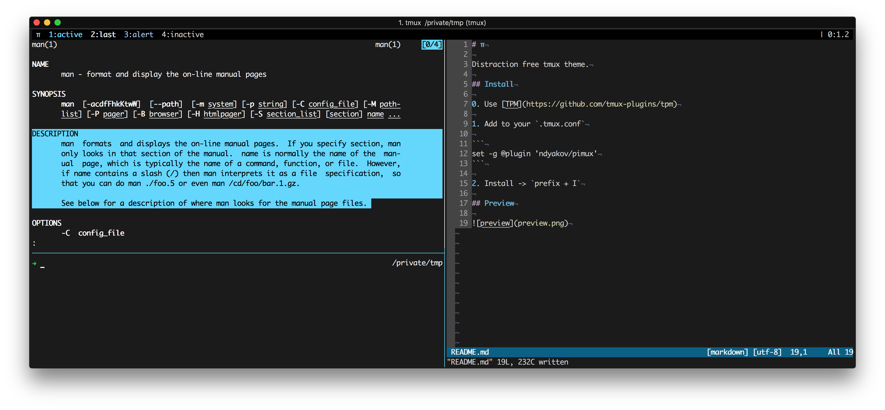

# π

Distraction free tmux theme.

## Install

0. Use [TPM](https://github.com/tmux-plugins/tpm)

1. Add to your `.tmux.conf`

```
set -g @plugin 'ndyakov/pimux'
```

2. Install -> `prefix + I`

3. Preview


